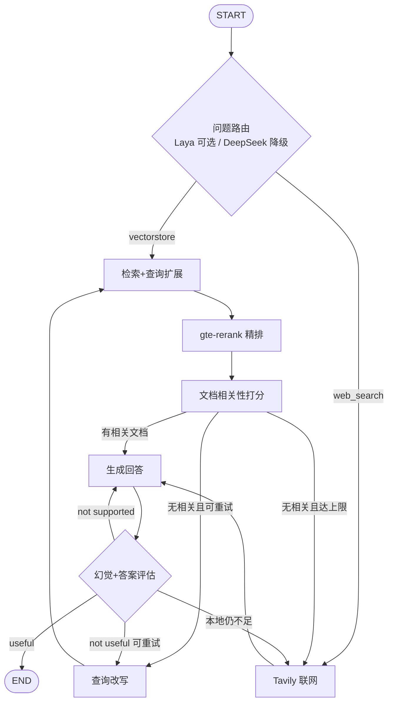

# RAG 企业知识库 · 半导体 Adaptive RAG

面向**半导体工艺 / 设备 / 材料**场景的检索增强问答系统：  
云端 MinerU 解析 → Milvus 混合检索 →（可选）Laya System-1 快路由 → LangGraph Adaptive RAG（含 Cross-Encoder 精排与纠错熔断；本地不足时 Tavily 联网）→ FastAPI SSE + 多会话 Web UI。


---

## 功能一览

| 能力 | 说明 |
|------|------|
| Adaptive RAG + CRAG | 路由 → 检索 → 精排 → 文档打分 → 生成 → 幻觉/答案评估 → 改写重试 / 联网 |
| 混合检索 | Milvus Dense（HNSW）+ BM25 Sparse，RRF 融合；查询扩展后多路合并去重 |
| Cross-Encoder 精排 | DashScope `gte-rerank` 对召回块重排取 Top-N（失败则截断降级） |
| 可选 Laya 意图路由 | 本地 System-1 `choice` 分流 `vectorstore` / `web_search`；低置信或不可用回退 DeepSeek |
| 多轮 / 多会话 | 指代消解 + Redis / SQLite 会话记忆；前端侧栏隔离 `session_id` |
| 流式输出 | SSE：`status` / `token` / `reset` / `done`，支持客户端断开中止 |
| 知识库引用 | 本地回答由系统按 `filename` / `title` 拼接引用，降低来源编造 |
| 语料建设 | MinerU 解析、arXiv 主题抓取、`datas/md/primer_*.md` 工艺百科补概念空洞 |
| 评测 | RAGAS（faithfulness / answer_relevancy）+ `web_fallback_rate` 联网率 KPI |
| 健康检查 | `GET /health`、`GET /metrics`（Prometheus 文本） |

---

## 系统架构

```text
┌─────────────┐     SSE/HTTP      ┌──────────────┐
│  index.html │ ───────────────► │   main.py    │
│ 多会话前端   │ ◄─────────────── │   FastAPI    │
└─────────────┘                   └──────┬───────┘
                                         │
          ┌──────────────────────────────┼──────────────────────────────┐
          ▼                              ▼                              ▼
   ┌──────────────┐            ┌────────────────┐            ┌─────────────┐
   │ Redis/SQLite │            │ graph2/        │            │ DeepSeek    │
   │ 会话记忆      │            │ LangGraph RAG  │───────────►│ + DashScope │
   └──────────────┘            └────────┬───────┘            └─────────────┘
                                        │
          ┌─────────────────────────────┼─────────────────────────────┐
          ▼                             ▼                             ▼
    ┌──────────┐                 ┌──────────┐                  ┌──────────┐
    │  Milvus  │                 │  Tavily  │                  │  MinerU  │
    │ 混合检索  │                 │ 联网兜底  │                  │ 云端解析  │
    └──────────┘                 └──────────┘                  └──────────┘
          ▲
          │ 可选
    ┌──────────┐
    │   Laya   │  System-1 意图路由（默认关闭）
    └──────────┘
```

### LangGraph 主流程（`graph2/`）



---

## 技术栈

| 层级 | 选型 |
|------|------|
| 编排 | LangChain / LangGraph |
| LLM | DeepSeek Chat（OpenAI 兼容） |
| Embedding / 精排 | DashScope `text-embedding-v3` / `gte-rerank` |
| 可选路由 | Laya System-1（`laya[serve]`，HTTP `/v1/systemone`） |
| 向量库 | Milvus Standalone（Dense HNSW + BM25 Sparse，RRF） |
| 联网搜索 | Tavily |
| 文档解析 | MinerU 云端 API |
| API | FastAPI + SSE |
| 前端 | 原生 HTML/CSS/JS（`index.html`） |
| 会话 | Redis（推荐）/ SQLite / 内存降级 |
| 评测 | RAGAS |


---


---

## 环境准备

### 1. 基础依赖

- Docker Desktop（Milvus）
- Redis
- Conda / Python 3.11
- Laya serve：GPU

### 2. 启动 Milvus

```powershell
docker start milvus-standalone
# 首次请按 Milvus 官方文档拉起 standalone；默认 gRPC: 127.0.0.1:19530
```

### 3. Python 环境

```powershell
conda activate rag_env
cd <项目根目录>
pip install -r requirements.txt
pip install "ragas>=0.2.0" datasets redis
# 可选 Laya 服务端（与主应用分离进程）
# pip install "laya[serve]"
```


常用项：

| 变量 | 说明 |
|------|------|
| `DEEPSEEK_API_KEY` | 对话 / 路由降级 / 打分 / RAGAS |
| `DASHSCOPE_API_KEY` | Embedding + `gte-rerank` |
| `TAVILY_API_KEY` | 联网搜索 |
| `MINERU_API_TOKEN` | 云端解析 |
| `MILVUS_URI` / `COLLECTION_NAME` | 向量库 |
| `SESSION_BACKEND` / `REDIS_URL` | 会话持久化 |
| `LAYA_ENABLED` | 默认 `false`；`true` 时启用 Laya 路由 |
| `LAYA_SERVER_URL` | 默认 `http://127.0.0.1:8000` |
| `LAYA_MODEL` | 默认 `convaiinnovations/laya-multilingual` |
| `LAYA_CONFIDENCE_MIN` | 低于此置信度回退 DeepSeek |

完整模板见 `.env.example`。

---

## 快速启动

```powershell
# 终端 1：后端
conda activate rag_env
cd <项目根目录>
uvicorn main:app --host 127.0.0.1 --port 8001

# 终端 2：前端静态页
python -m http.server 8080
```

浏览器：<http://127.0.0.1:8080/index.html>

| 服务 | 地址 |
|------|------|
| Web UI | http://127.0.0.1:8080/index.html |
| API / Docs | http://127.0.0.1:8001 · http://127.0.0.1:8001/docs |
| Health | http://127.0.0.1:8001/health |
| Milvus | http://127.0.0.1:19530 |

> 部署到公网时请修改 `index.html` 中的 `API_BASE`，或用 Nginx 同域反代 `/chat`（SSE 需关闭 `proxy_buffering`）。

### 可选：启用 Laya 意图路由

```powershell
# 另开终端
pip install "laya[serve]"
$env:LAYA_DEVICE="cuda"   # 或 cpu
$env:LAYA_PRELOAD="1"
$env:LAYA_MODELS="multilingual"
laya-serve
```

`.env` 设置 `LAYA_ENABLED=true` 后重启 uvicorn。日志出现 `Laya 路由到…` 即生效；服务不可用或低置信度时自动降级 DeepSeek。

---

## API 说明

### `POST /chat` · `POST /chat/stream`

请求体：`{ "question": "...", "session_id": "可选" }`

SSE 事件：`session` / `status` / `reset` / `token` / `done` / `aborted` / `error`

### `DELETE /chat/memory/{session_id}`

清空指定会话服务端记忆。

### `GET /health` · `GET /metrics`

组件探活与 Prometheus 风格指标。

---

## 语料与入库

| 路径 | 用途 |
|------|------|
| `datas/raw/` | PDF 等原始件 |
| `datas/md/primer_*.md` | 工艺百科（CMP / 刻蚀 / 光刻 / EUV 等） |
| `datas/md/mineru_arxiv_*.md` | MinerU 解析的公开论文样例 |
| Milvus `t_collection01` | 切块向量 + BM25 |

```powershell
# 本地 raw → md → 追加入库
python documents/mineru_batch.py --ingest

# 远程 PDF URL
python documents/mineru_batch.py --url "https://arxiv.org/pdf/XXXX.XXXXX.pdf" --name "arxiv_XXXX.XXXXX.pdf" --ingest

# 主题抓取
python documents/topic_crawl.py --limit 5 --ingest

# 仅入库已有工艺百科
python -c "from pathlib import Path; from documents.mineru_batch import ingest_markdown_files; print(ingest_markdown_files(sorted(Path('datas/md').glob('primer_*.md'))))"
```

建表约定：

- 日常：`ensure_collection_exists` / `create_connection`（**幂等，不删库**）
- 清库重建：必须 `create_collection(force=True)` / `recreate_collection(force=True)`
- 支持工艺分区名（`lithography` / `etch` / …）；检索侧提供 `get_partition_retriever`

详见 `CONTEXT.md`、`docs/adr/0001-*.md`、`docs/adr/0002-quality-sprint-over-enterprise.md`。

---

## RAGAS 评测

```powershell
python eval/run_ragas.py --limit 2 --metrics fast
python eval/run_ragas.py --metrics fast --out eval/ragas_report.json
```

- 金标：`eval/gold_set.json`（约 15 题）
- 报告含 `faithfulness`、`answer_relevancy`、`web_fallback_rate`
- DeepSeek 裁判需 `n=1`；脚本已设 `AnswerRelevancy(strictness=1)`

---

## 前端多会话

- 左侧新建 / 切换 / 删除会话  
- 浏览器 `localStorage` 存 UI 消息；服务端按 `session_id` 存多轮记忆  
- 「清空本会话」只影响当前会话  

---


## 许可证与声明

- 代码：学习 / 演示 / 二次开发底座  
- 第三方服务遵循各自条款与配额  
- 知识库内容版权由语料方负责  

---

