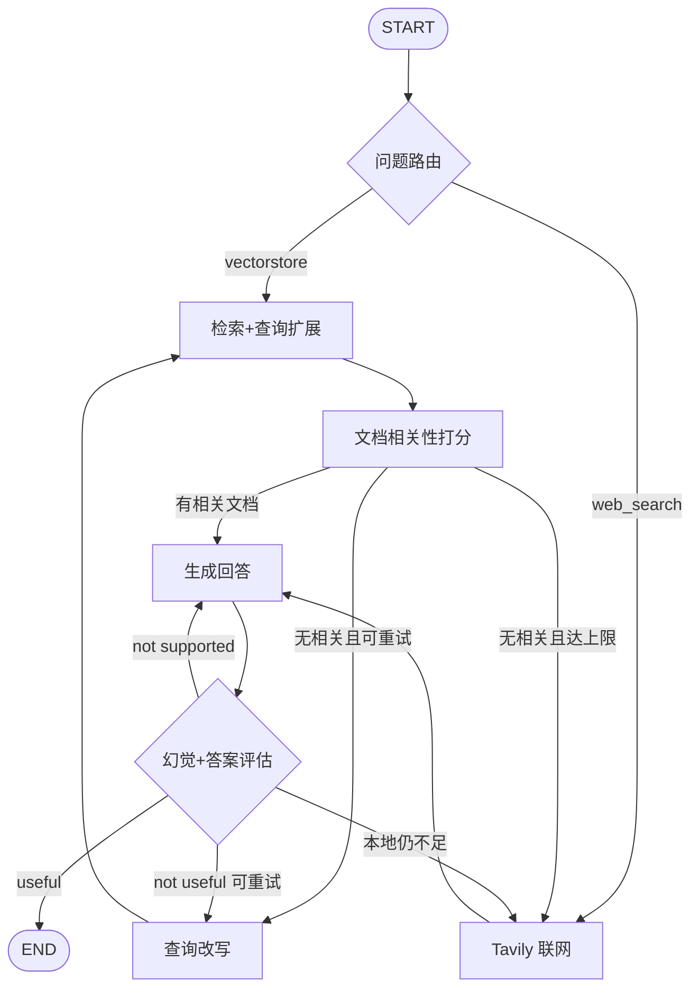

# RAG 企业知识库 · 半导体 Adaptive RAG

面向**半导体工艺 / 设备 / 材料**场景的检索增强问答系统：  
云端 MinerU 解析文档 → Milvus 混合检索 → LangGraph Adaptive RAG（本地不足时 Tavily 联网兜底）→ FastAPI SSE + 多会话 Web UI。

> 当前定位为**可演示的工程原型**（含持久会话、知识库引用、主题抓取、RAGAS 评测）。上生产前请补齐鉴权、限流、合规与评测门禁，参见文末「企业化差距」。

---

## 功能一览

| 能力 | 说明 |
|------|------|
| Adaptive RAG | 问题路由 → 检索 → 文档打分 → 生成 → 幻觉/答案评估 → 改写重试 / 联网 |
| 混合检索 | Milvus Dense（向量）+ BM25 Sparse，查询扩展后多路合并 |
| 多轮对话 | 指代消解（contextualize）+ Redis / SQLite 会话记忆 |
| 多会话 UI | 左侧会话栏，各 `session_id` 上下文互不干扰 |
| 流式输出 | SSE：`status` / `token` / `done`，支持终止生成 |
| 知识库引用 | 本地回答文末系统拼接 `filename` / `title`（防模型瞎编链接） |
| 文档解析入库 | 云端 MinerU（本地上传 / 远程 URL）→ Markdown → 语义切块 → 追加入库 |
| 主题抓取 | arXiv FEOL 主题包检索 → MinerU 远程解析 → 去重入库 |
| 质量评估 | RAGAS（faithfulness / answer_relevancy 等） |

---

## 系统架构

```text
┌─────────────┐     SSE/HTTP      ┌──────────────┐
│  index.html │ ───────────────► │   main.py    │
│ 多会话前端   │ ◄─────────────── │   FastAPI    │
└─────────────┘                   └──────┬───────┘
                                         │
                    ┌────────────────────┼────────────────────┐
                    ▼                    ▼                    ▼
            ┌──────────────┐    ┌────────────────┐    ┌─────────────┐
            │ Redis/SQLite │    │ graph2/        │    │ DeepSeek    │
            │ 会话记忆      │    │ LangGraph RAG  │───►│ + DashScope │
            └──────────────┘    └────────┬───────┘    └─────────────┘
                                         │
                    ┌────────────────────┼────────────────────┐
                    ▼                    ▼                    ▼
              ┌──────────┐        ┌──────────┐         ┌──────────┐
              │  Milvus  │        │  Tavily  │         │  MinerU  │
              │ 混合检索  │        │ 联网兜底  │         │ 云端解析  │
              └──────────┘        └──────────┘         └──────────┘
```

### LangGraph 主流程（`graph2/`）



---

## 技术栈

| 层级 | 选型 |
|------|------|
| 编排 | LangChain / LangGraph |
| LLM | DeepSeek Chat（OpenAI 兼容接口） |
| Embedding | 阿里云百炼 `text-embedding-v3`（DashScope） |
| 向量库 | Milvus Standalone（Dense + BM25 Sparse） |
| 联网搜索 | Tavily |
| 文档解析 | MinerU 云端 API |
| API | FastAPI + SSE |
| 前端 | 原生 HTML/CSS/JS（`index.html`） |
| 会话 | Redis（推荐）/ SQLite / 内存降级 |
| 评测 | RAGAS |

Python 建议：**3.11**，Conda 环境名示例：`rag_env`。

---

## 目录结构

```text
RAG_PROJECT/
├── main.py                 # FastAPI：/chat、/chat/stream、清空记忆
├── index.html              # 多会话 Web UI
├── requirements.txt        # 依赖锁定
├── .env.example            # 环境变量模板（无密钥）
├── CONTEXT.md              # 领域术语表
├── docs/adr/               # 架构决策记录
├── graph2/                 # Adaptive RAG 图（当前主路径）
│   ├── graph_2.py          # 图定义与条件边
│   ├── retriever_node.py   # 查询扩展 + 检索合并
│   ├── generate_node2.py   # 生成 + 本地引用
│   ├── web_search_node.py  # Tavily
│   ├── contextualize_chain.py
│   └── …_grader / grade_*  # 打分与改写
├── documents/              # 解析 / 入库 / 抓取
│   ├── mineru_client.py
│   ├── mineru_batch.py
│   ├── topic_crawl.py
│   ├── markdown_parser.py
│   └── milvus_db.py
├── tools/retriever_tools.py
├── llm_models/             # LLM / Embedding 封装
├── utils/                  # env、日志、会话记忆
├── eval/                   # RAGAS 金标与评测脚本
├── datas/
│   ├── raw/                # 待解析原始文件
│   └── md/                 # MinerU / 既有 Markdown
├── graph/                  # 早期图实验（可参考）
└── agent/                  # 其它实验代码
```

---

## 环境准备

### 1. 基础依赖

- Docker Desktop（运行 Milvus）
- Redis（可选，多会话持久化推荐）
- Conda / Python 3.11

### 2. 启动 Milvus

```powershell
docker start milvus-standalone
# 首次需按官方文档拉起 standalone；默认 gRPC: 127.0.0.1:19530
```

### 3. Python 环境

```powershell
conda activate rag_env
cd <项目根目录>
pip install -r requirements.txt
# 评测额外依赖（若未装）：
pip install "ragas>=0.2.0" datasets redis
```

### 4. 配置环境变量

```powershell
copy .env.example .env
# 编辑 .env，填入真实 Key（切勿提交到 Git）
```

必填项通常包括：

- `DEEPSEEK_API_KEY`
- `DASHSCOPE_API_KEY`
- `TAVILY_API_KEY`
- `MINERU_API_TOKEN`（解析入库时）
- `REDIS_URL` + `SESSION_BACKEND=redis`（推荐）

---

## 快速启动

### 后端

```powershell
conda activate rag_env
cd <项目根目录>
uvicorn main:app --host 127.0.0.1 --port 8001
```

启动日志中应能看到会话后端，例如：`会话记忆后端: Redis (...)`。

### 前端

另开终端：

```powershell
cd <项目根目录>
python -m http.server 8080
```

浏览器打开：<http://127.0.0.1:8080/index.html>

| 服务 | 地址 |
|------|------|
| Web UI | http://127.0.0.1:8080/index.html |
| API | http://127.0.0.1:8001 |
| Milvus | http://127.0.0.1:19530 |
| Redis | redis://127.0.0.1:6379/0 |

---

## API 说明

### `POST /chat`

一次性返回完整答案（兼容旧客户端）。

```json
{ "question": "什么是 EUV 光刻？", "session_id": "可选-uuid" }
```

### `POST /chat/stream`

SSE 事件类型：

| type | 含义 |
|------|------|
| `session` | 确认 / 下发 `session_id` |
| `status` | 节点状态文案（检索中、联网中…） |
| `reset` | 清空当前流式草稿（进入改写/联网/新一轮生成） |
| `token` | 回答增量 token |
| `done` | 最终完整答案 |
| `aborted` / `error` | 终止或错误 |

### `DELETE /chat/memory/{session_id}`

清空指定会话在服务端的多轮记忆（不影响其它会话）。

---

## 语料与入库

### 路径约定

| 路径 | 用途 |
|------|------|
| `datas/raw/` | PDF / Office / 图片等原始件 |
| `datas/md/` | 解析后的 Markdown |
| Milvus `t_collection01` | 切块后的向量 + BM25 |

### 本地文件批量解析

```powershell
# 将文件放入 datas/raw 后
python documents/mineru_batch.py --ingest
```

### 远程 URL（MinerU 拉 PDF）

```powershell
python documents/mineru_batch.py --url "https://arxiv.org/pdf/XXXX.XXXXX.pdf" --name "arxiv_XXXX.XXXXX.pdf" --ingest
```

### 半导体主题抓取（arXiv FEOL 包）

```powershell
python documents/topic_crawl.py --limit 5 --dry-run
python documents/topic_crawl.py --limit 5 --ingest
```

默认主题：光刻 / 刻蚀 / 沉积 / CMP / 量测。  
去重：本地 md 中的 arXiv id + Milvus `filename`。  
约定详见 `CONTEXT.md`、`docs/adr/0001-semiconductor-corpus-acquisition.md`。

> **注意**：`documents/milvus_db.py` 中 `create_collection()` 会 **drop 重建**集合。日常扩库请用 `--ingest` **追加**路径，勿误跑全量重建脚本。

---

## RAGAS 评测

```powershell
python eval/run_ragas.py --limit 2 --metrics fast   # 试跑
python eval/run_ragas.py --metrics fast             # 全量金标（fast 指标）
python eval/run_ragas.py                            # 含 context_recall / precision
```

- 金标：`eval/gold_set.json`（`question` + `ground_truth`）
- 报告：`eval/ragas_report.json`
- 裁判模型：DeepSeek（`temperature=0`）；Embedding：DashScope  
- DeepSeek 仅支持 `n=1`，脚本已将 `AnswerRelevancy(strictness=1)`

更多说明见 [`eval/README.md`](eval/README.md)。

---

## 前端多会话

- 左侧新建 / 切换 / 删除会话  
- 浏览器 `localStorage` 存会话列表与消息；服务端 Redis 按 `session_id` 存多轮记忆  
- 「清空本会话」只清当前会话，其它会话不受影响  

---

## 配置项摘要

| 变量 | 说明 |
|------|------|
| `DEEPSEEK_API_KEY` | 对话 / 路由 / 打分 / RAGAS 裁判 |
| `DASHSCOPE_API_KEY` | Embedding |
| `TAVILY_API_KEY` | 联网搜索 |
| `MINERU_API_TOKEN` | 云端解析 |
| `MILVUS_URI` | 默认 `http://127.0.0.1:19530` |
| `COLLECTION_NAME` | 默认 `t_collection01` |
| `SESSION_BACKEND` | `auto` / `redis` / `sqlite` / `memory` |
| `REDIS_URL` | 如 `redis://127.0.0.1:6379/0` |
| `SESSION_TTL_SECONDS` | Redis 会话 TTL，默认 7 天 |

完整模板：`.env.example`。

---

## 上传 GitHub 前检查清单

- [ ] 确认 `.env` 在 `.gitignore` 中，**从未提交真实 Key**
- [ ] 使用 `.env.example` 作为配置说明
- [ ] 大体积 PDF / 私有语料是否需要排除或使用 Git LFS
- [ ] `eval/ragas_report.json`、本地 `*.db`、`.idea/`、`.cursor/` 等已忽略
- [ ] README 中的端口、集合名与本地一致
- [ ] 若语料含版权敏感内容，在仓库声明「仅演示 / 请自备授权语料」

建议首次提交命令（自行确认文件列表后再 commit）：

```powershell
git status
git add README.md .env.example .gitignore CONTEXT.md docs eval documents graph2 utils tools llm_models main.py index.html requirements.txt datas/raw/README.md
# 按需添加 datas/md 中可公开的样例，勿添加密钥与私有 PDF
```

---

## 企业化差距（已知）

原型已具备主链路，上生产前建议补齐：

1. API 鉴权、CORS 白名单、限流与配额  
2. 禁止默认 `drop_collection`；入库作业化与审计  
3. 语料版权合规闸门（当前 ADR 标明演示策略可放宽）  
4. 多租户 / ACL、结构化可观测性、CI + RAGAS 回归门禁  

---

## 许可证与声明

- 代码用途：学习 / 演示 / 二次开发底座  
- 第三方服务（DeepSeek、DashScope、MinerU、Tavily、arXiv 等）遵循各自条款与配额  
- 知识库内容版权由语料提供方负责；演示抓取策略**不代表**生产合规标准  

---

## 致谢

- [LangChain](https://github.com/langchain-ai/langchain) / [LangGraph](https://github.com/langchain-ai/langgraph)  
- [Milvus](https://milvus.io/)  
- [MinerU](https://mineru.net/)  
- [RAGAS](https://github.com/explodinggradients/ragas)  
- DeepSeek / 阿里云百炼 / Tavily  
