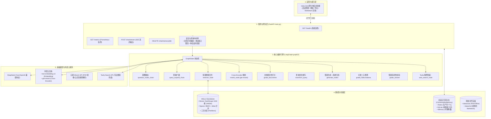

# 半导体企业知识库 Adaptive RAG 系统 · 技术架构与设计文档

> 注：本文件为 `../prd/技术文档.md` 的工作区镜像副本，内容保持完全一致。

---

## 1. 文档信息

| 文档版本 | 编写日期 | 编写人 | 技术栈 | 状态 |
| :--- | :--- | :--- | :--- | :--- |
| **v2.0.0** | 2026-09-22 | Lead AI Architect | LangGraph / Milvus / FastAPI / DeepSeek / DashScope | 正式发布 |

---

## 2. 系统总体技术架构 (System Architecture)

系统采用分层微服务与状态机编排架构，由接入呈现层、网关服务层、LangGraph 核心编排层、存储持久化层以及外部大模型/云端服务层构成。

---

## 3. 存储与向量检索系统设计 (Data & Vector Store)

### 3.1 Milvus Schema 混合索引设计
- **Dense 索引参数**：`IndexType.HNSW`，度量类型为内积 `MetricType.IP`，超参 `M=16, efConstruction=64`；
- **Sparse 索引参数**：`IndexType.SPARSE_INVERTED_INDEX`，度量类型 `MetricType.BM25`，超参 `bm25_k1=1.2, bm25_b=0.75`；
- **混合检索策略**：采用 LangChain Milvus 的 `rrf`（Reciprocal Rank Fusion，倒排互惠排名）多路合并算法，设置 `ranker_params={"k": 100}`。

### 3.2 幂等安全建表与分区管理 (Partitioning)
1. **幂等建表 `ensure_collection_exists()`**：仅当集合不存在时初始化建表，跳过重复创建；
2. **防误删防御 `recreate_collection(force=False)`**：必须显式声明 `force=True` 才允许删除集合重建；
3. **半导体工艺分区 (Partitions)**：预设 6 大分区：`lithography`、`etch`、`deposition`、`cmp`、`metrology`、`general`，支持隔离定向检索。

---

## 4. 核心编排引擎：Adaptive RAG 状态机 (`graph2/`)

### 4.1 节点拓扑流转
1. **多路查询扩展与召回 (`query_expand_chain.py` & `retriever_node.py`)**：生成 2~4 条子查询，检索去重合并为 8 篇候选切片；
2. **Cross-Encoder 深度重排 (`graph2/rerank_node.py`)**：接入 DashScope `gte-rerank` 计算深度交叉注意力相似度，精排选出 Top 4 高质切片；
3. **自省校验与动态熔断兜底 (`grade_hallucinations` & `grade_answer`)**：防幻觉校验 + 答案可用性校验，若本地资料不足重试后自动熔断转 Tavily 联网搜索；
4. **系统级引用拼装 (`generate_node2.py`)**：系统提取真实元数据拼接【知识库引用】，严禁大模型胡编参考文献。

---

## 5. 服务层工程化与可观测性 (`main.py`)

- **SSE 事件流协议**：支持 `session`、`status`、`reset`、`token`、`done`、`aborted`、`error` 细粒度生命周期；
- **全局异常拦截**：捕获未处理错误，日志全量记录堆栈，对外返回友好结构；
- **滑动窗口限流**：每 IP 60 秒限 45 次，防脚本刷爆；
- **单会话并发流锁**：同一 `session_id` 生成过程中阻止重复发送（返回 409）；
- **服务自检与监控**：`GET /health` 检测组件连通性，`GET /metrics` 输出 Prometheus 格式的 TTFT 与时延指标。
